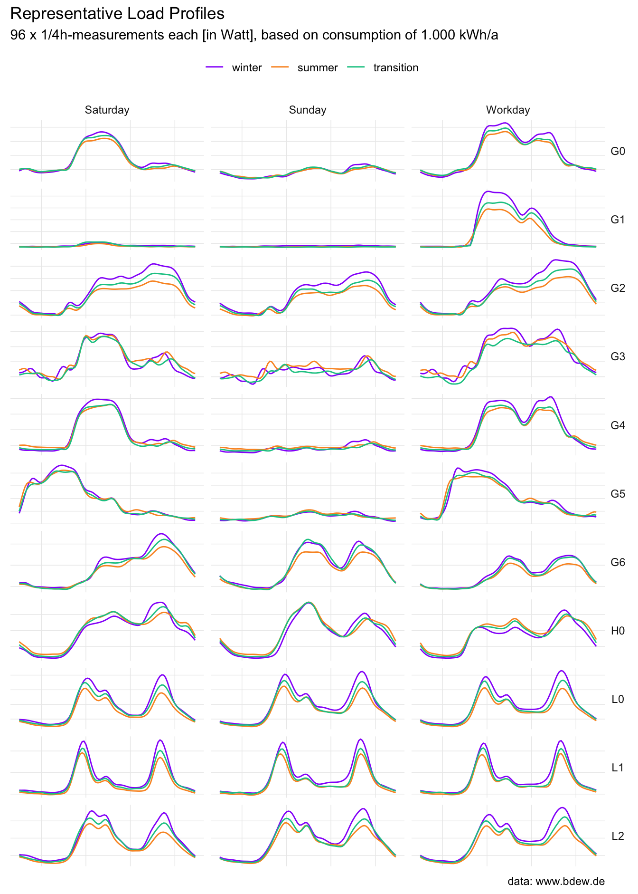
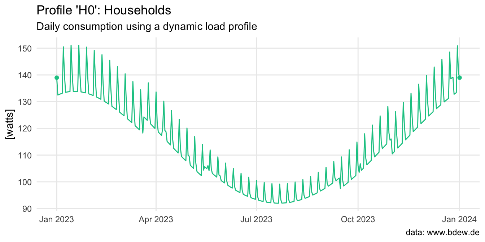

<!-- README.md is generated from README.Rmd. Please edit that file -->

# standardlastprofile

<!-- badges: start -->

[](https://codecov.io/gh/flrd/standardlastprofile)
<!-- [](https://cran.r-project.org/package=standardlastprofile) -->
[](https://github.com/flrd/standardlastprofile/actions/workflows/R-CMD-check.yaml)
<!-- badges: end -->

This package provides data about representative, standardized load
profiles for electricity from the German Association of Energy and Water
Industries (BDEW Bundesverband der Energie- und Wasserwirtschaft e.V.)
in a tidy format. These load profiles are used by energy suppliers to
create an annual consumption forecast for their customers. A load
profile is a simplification that does not necessarily correspond to the
consumption profile of an individual customer, but is a valid
approximation for a larger group of similar customers.



## Installation

You can install the development version of standardlastprofile from
[GitHub](https://github.com/) with:

``` r
# install.packages("devtools")
devtools::install_github("flrd/standardlastprofile")
```

## About the data

The standardlastprofile package contains one dataset called
`load_profiles`. These profiles were created on the basis of a total of
1,209 individual customer load profiles, which were classified according
to customer group, period of the year and day of the week.

Given a profile, a period and a day there are 96 x 1/4h-measurements in
watts, based on a normalized annual consumption of 1.000 kWh. See
vignette .. . In total the dataset contains 9,504 observations of five
variables:

``` r
str(load_profiles)
#> 'data.frame':    9504 obs. of  5 variables:
#>  $ profile  : chr  "H0" "H0" "H0" "H0" ...
#>  $ period   : chr  "winter" "winter" "winter" "winter" ...
#>  $ day      : chr  "saturday" "saturday" "saturday" "saturday" ...
#>  $ timestamp: chr  "00:00" "00:15" "00:30" "00:45" ...
#>  $ watt     : num  70.8 68.2 65.9 63.3 59.5 55 50.5 46.6 43.9 42.3 ...
```

If you have no idea what `H0` etc. stands for, you are not alone.

- `H0`: households (German: “Haushalte”)
- `G0` to `G6`: commerce (“Gewerbe”)
- `L0` to `L2`: agriculture (“Landwirtschaft”)

Call `get_load_profile_info()` for more information and examples.

``` r
get_load_profile_info(language = "EN")$H0
#> $profile
#> [1] "H0"
#> 
#> $description
#> [1] "household"
#> 
#> $details
#> [1] "This profile includes all households with exclusively and predominantly private consumption. Households with predominantly private electrical consumption, i.e. also with minor commercial consumption are e.g. sales representatives, home workers, etc. with an office in the household. The Household profile is not applicable for special applications such as storage heaters or heat pumps."
```

### Generate a load profile

Use the function `get_load_profile()` to generate a load profile.

``` r
get_load_profile(profile = "G5",
                 start_date = "2023-12-22",
                 end_date = "2023-12-27")
```

The algorithm sets a public holiday to be a Sunday, December 24 and 31
to be a Saturday – if they are not a Sunday. **Note**: As of now the
package supports only public holidays for Germany, which were retrieved
from the [nager.Date API](https://github.com/nager/Nager.Date).


In contrast to most commercial and agricultural businesses, which have a
relatively even and a fairly constant power consumption over the course
of a year, households on the other hand have a continuously decreasing
load from winter to summer and vice versa.

``` r
get_load_profile(profile = "H0",
                 start_date = "2023-01-01",
                 end_date = "2024-01-01")
```

This is taken into account by applying a dynamization function (4th
order polynomial), see
[bdew.de](https://www.bdew.de/media/documents/1999_Repraesentative-VDEW-Lastprofile.pdf),
page 32/46.



## Source

Data and information about the methodology can be found on website of
the BDEW: <https://www.bdew.de/energie/standardlastprofile-strom/>

## Code of Conduct

Please note that this project is released with a [Contributor Code of
Conduct](https://github.com/flrd/standardlastprofile/blob/master/conduct.md).
By participating in this project you agree to abide by its terms.
