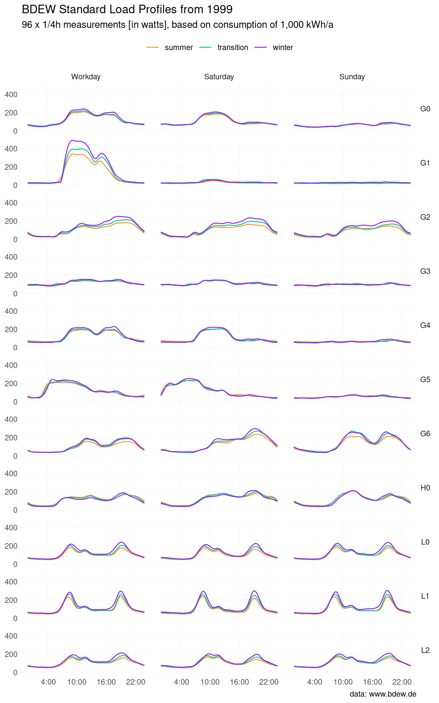
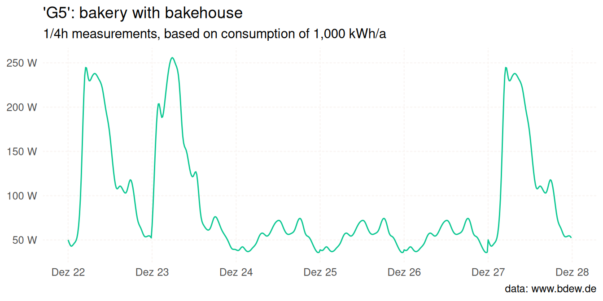

<!-- README.md is generated from README.Rmd. Please edit that file -->

# standardlastprofile

<!-- badges: start -->
<!-- [](https://cran.r-project.org/package=standardlastprofile) -->
<!-- [](https://cran.r-project.org/package=standardlastprofile) -->

[](https://github.com/flrd/standardlastprofile/actions/workflows/R-CMD-check.yaml)
[](https://app.codecov.io/gh/flrd/standardlastprofile)
<!-- badges: end -->

This package provides data on representative, standard load profiles for
electricity from the German Association of Energy and Water Industries
(BDEW Bundesverband der Energie- und Wasserwirtschaft e.V.) in a tidy
format.



## Installation

<!-- You can install standardlastprofile from CRAN with: -->
<!-- ```{r eval=FALSE} -->
<!-- install.packages("standardlastprofile") -->
<!-- ``` -->

You can install the development version of standardlastprofile from
[GitHub](https://github.com/), call:

``` r
# install.packages("devtools")
devtools::install_github("flrd/standardlastprofile")
```

## Included Features

- `slp` – A dataset containing BDEW standard load profiles for
  electricity.
- `slp_generate()` – An interface for generating a standard load profile
  for a user-defined time period.
- `slp_info()` – A function for retrieving details of standard load
  profiles.

## About the data

The standardlastprofile package encompasses a dataset named slp. This
dataset results from an analysis of 1,209 load profiles of low-voltage
electricity consumers in Germany, published in 1999.[^1] It comprises a
total of 9,504 observations across 5 variables:

- `profile_id`: identifier of a standard load profile
- `period`: one of “summer”, “winter”, “transition”
- `day`: one of “workday”, “saturday”, “sunday”
- `timestamp`: format “%H:%M”
- `watts`: electric power

``` r
str(slp)
#> 'data.frame':    9504 obs. of  5 variables:
#>  $ profile_id: chr  "H0" "H0" "H0" "H0" ...
#>  $ period    : chr  "winter" "winter" "winter" "winter" ...
#>  $ day       : chr  "saturday" "saturday" "saturday" "saturday" ...
#>  $ timestamp : chr  "00:00" "00:15" "00:30" "00:45" ...
#>  $ watts     : num  70.8 68.2 65.9 63.3 59.5 55 50.5 46.6 43.9 42.3 ...
```

In the context of the German electricity market, the term ‘Standard Load
Profile’ denotes a representative pattern of electricity consumption
over a specific period. These profiles portray anticipated electricity
consumption for diverse customer groups, like households or businesses.
While not an exact match for an individual customer’s consumption
profile, they serve as a valid approximation for larger groups of
similar customers.

For each unique combination of `profile_id`, `period` and `day` there
are 96 x 1/4 hour measurements in watts. If you have no idea what `H0`
means, you are not alone:

- `H0`: households (German: “Haushalte”)
- `G0` to `G6`: commerce (“Gewerbe”)
- `L0` to `L2`: agriculture (“Landwirtschaft”)

For more details, call the `slp_info()` function.

``` r
slp_info(profile_id = "H0", language = "DE")
#> $H0
#> $H0$profile
#> [1] "H0"
#> 
#> $H0$description
#> [1] "Haushalt"
#> 
#> $H0$details
#> [1] "In dieses Profil werden alle Haushalte mit ausschließlichem und überwiegendem Privatverbrauch eingeordnet. Haushalte mit überwiegend privatem elektrischen Verbrauch, d.h. auch mit geringfügigem gewerblichen Bedarf sind z.B. Handelsvertreter, Heimarbeiter u.ä. mit Büro im Haushalt. Das Profil Haushalt ist nicht anwendbar bei Sonderanwendungen wie z.B. elektrischen Speicherheizungen oder Wärmepumpen."
```

### Generate a standard load profile

To create a standard load profile for a specified time period, call the
`slp_generate()` function:

``` r
G5 <- slp_generate(
  profile_id = "G5",
  start_date = "2023-12-22",
  end_date = "2023-12-27"
  )

head(G5)
#>   profile_id          start_time            end_time watts
#> 1         G5 2023-12-22 00:00:00 2023-12-22 00:15:00  50.1
#> 2         G5 2023-12-22 00:15:00 2023-12-22 00:30:00  47.4
#> 3         G5 2023-12-22 00:30:00 2023-12-22 00:45:00  44.9
#> 4         G5 2023-12-22 00:45:00 2023-12-22 01:00:00  43.3
#> 5         G5 2023-12-22 01:00:00 2023-12-22 01:15:00  43.0
#> 6         G5 2023-12-22 01:15:00 2023-12-22 01:30:00  43.8
```



For more information, details about the data, and an explanation of the
algorithm, call
[`vignette("algorithm-step-by-step", package = "standardlastprofile")`](https://flrd.github.io/standardlastprofile/articles/algorithm-step-by-step.html).

## Source

You can access the studies and data on standard load profiles for
electricity by downloading them from the BDEW website:
<https://www.bdew.de/energie/standardlastprofile-strom/>

## Code of Conduct

Please note that this project is released with a [Contributor Code of
Conduct](https://github.com/flrd/standardlastprofile/blob/main/CODE_OF_CONDUCT.md).
By participating in this project you agree to abide by its terms.

[^1]: More information on the data and methodology can be found
    [here](https://www.bdew.de/media/documents/1999_Repraesentative-VDEW-Lastprofile.pdf).
