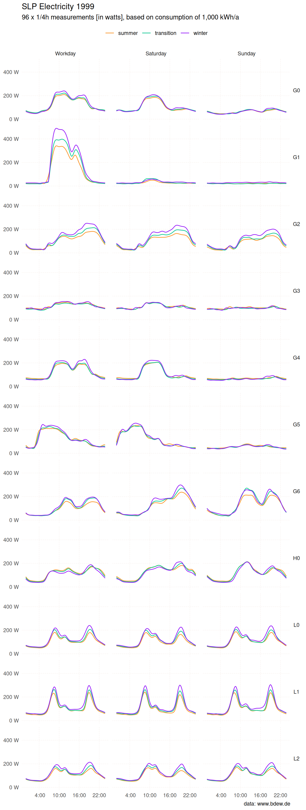
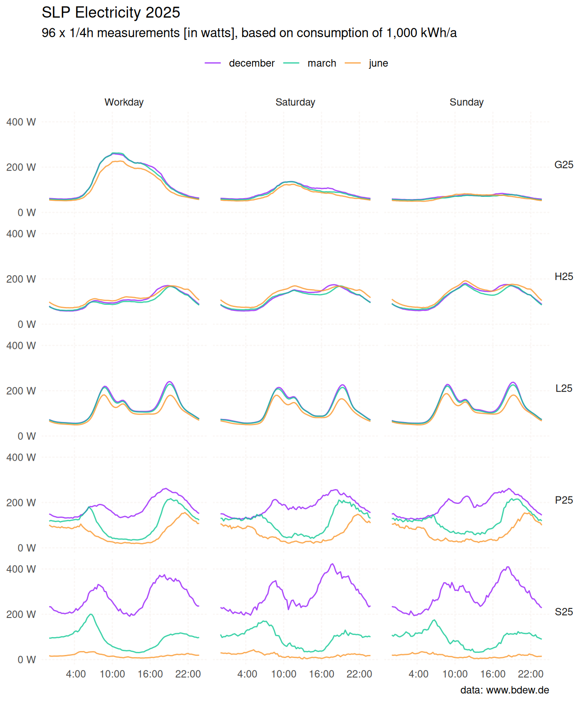
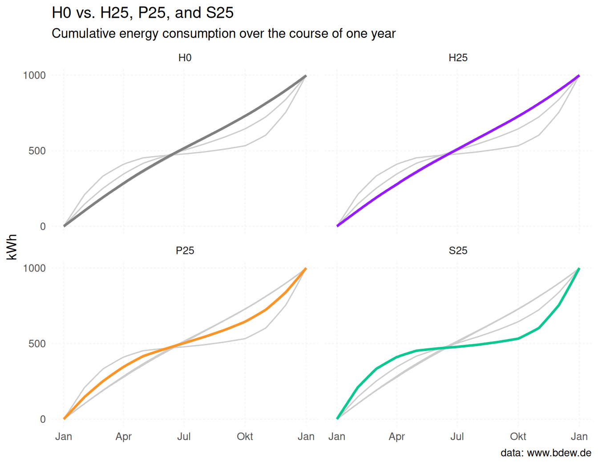
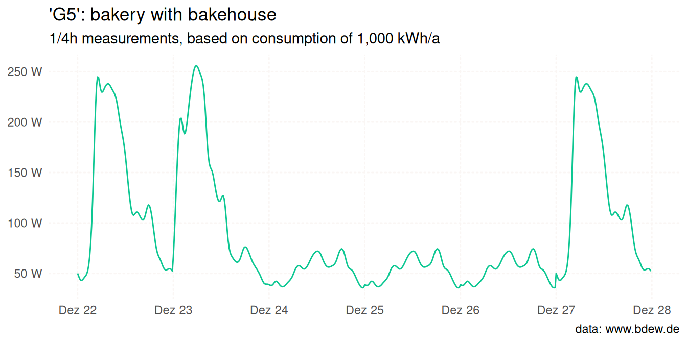

<!-- README.md is generated from README.Rmd. Please edit that file -->

# standardlastprofile

<!-- badges: start -->

[](https://github.com/flrd/standardlastprofile/actions/workflows/R-CMD-check.yaml)
[](https://app.codecov.io/gh/flrd/standardlastprofile)
[](https://cran.r-project.org/package=standardlastprofile)
[](https://cran.r-project.org/package=standardlastprofile)
<!-- badges: end -->

Standard load profiles (SLPs) for electricity and gas, published by the
German Association of Energy and Water Industries (BDEW Bundesverband
der Energie- und Wasserwirtschaft e.V.). SLPs are used by utilities,
distribution network operators, and the energy industry to forecast
demand for customer groups that are not continuously metered.



## Installation

``` r
install.packages("standardlastprofile")
```

## Included features

- `slp_info()` — descriptions for all electricity and gas profile IDs

**Electricity**

- `slp_electricity_profiles` — dataset of BDEW electricity SLPs in tidy
  format
- `slp_electricity()` — generate a 15-minute profile for any date range

**Gas**

- `slp_gas()` — daily gas consumption via the SigLinDe method (all 15
  BDEW profile IDs)
- \`slp_gas_coefficients()\`\` — retrieve SigLinDe coefficients for gas
  SLPs
- `slp_gas_kundenwert()` — derive the customer value (Kundenwert) from a
  reference temperature series
- `slp_gas_siglinde()` — low-level SigLinDe function, can be useful for
  custom or region-specific SigLinDe coefficients
- \`slp_gas_weekday_factors()\`\` — retrieve weekday factors for gas
  SLPs

## Electricity

The dataset `slp_electricity_profiles` contains 26,784 observations
across 5 variables:

- `profile_id`: load profile identifier
- `period`: `"summer"`, `"winter"`, or `"transition"` for 1999 profiles;
  a lowercase month name for 2025 profiles
- `day`: `"workday"`, `"saturday"`, or `"sunday"`
- `timestamp`: quarter-hour start time in `"%H:%M"` format
- `watts`: average electric power, normalised to 1,000 kWh/a

``` r
str(slp_electricity_profiles)
#> 'data.frame':    26784 obs. of  5 variables:
#>  $ profile_id: chr  "H0" "H0" "H0" "H0" ...
#>  $ period    : chr  "winter" "winter" "winter" "winter" ...
#>  $ day       : chr  "saturday" "saturday" "saturday" "saturday" ...
#>  $ timestamp : chr  "00:00" "00:15" "00:30" "00:45" ...
#>  $ watts     : num  70.8 68.2 65.9 63.3 59.5 55 50.5 46.6 43.9 42.3 ...
```

### 1999 profiles

Based on an analysis of 1,209 load profiles of low-voltage electricity
consumers in Germany[^1]:

- `H0`: households
- `G0`–`G6`: commercial
- `L0`–`L2`: agriculture

### 2025 profiles

An updated set published by BDEW in 2025, reflecting changes in
consumption patterns since the original study. Unlike the 1999 profiles
(three seasonal periods), the 2025 profiles provide values for each
calendar month:

- `H25`, `G25`, `L25`: updated household, commercial, and agriculture
  profiles
- `P25`: households with a photovoltaic (PV) system
- `S25`: households with a PV system and battery storage



The chart below compares cumulative energy consumption of the 2025
household profiles against `H0` over a full year. `H25` tracks `H0`
closely; `P25` and `S25` flatten from spring through summer as solar
generation and storage reduce grid draw.



### Generate a profile

`slp_electricity()` returns a data frame with one row per 15-minute
interval:

``` r
G5 <- slp_electricity(
  profile_id = "G5",
  start_date = "2023-12-22",
  end_date   = "2023-12-27"
)

head(G5)
#>   profile_id          start_time            end_time watts
#> 1         G5 2023-12-22 00:00:00 2023-12-22 00:15:00  50.1
#> 2         G5 2023-12-22 00:15:00 2023-12-22 00:30:00  47.4
#> 3         G5 2023-12-22 00:30:00 2023-12-22 00:45:00  44.9
#> 4         G5 2023-12-22 00:45:00 2023-12-22 01:00:00  43.3
#> 5         G5 2023-12-22 01:00:00 2023-12-22 01:15:00  43.0
#> 6         G5 2023-12-22 01:15:00 2023-12-22 01:30:00  43.8
```



### Public holidays

Both `slp_electricity()` and `slp_gas()` use the same holiday logic:
nine nationwide German public holidays are treated as Sundays by default
(New Year’s, Good Friday, Easter Monday, Labour Day, Ascension Day, Whit
Monday, German Unity Day, Christmas Day, Boxing Day). State-level
holidays are not included because they vary by state and can change. Use
the `holidays` argument in either function to supply your own dates —
the built-in data are then ignored entirely:

``` r
library(httr2)

resp <- request("https://date.nager.at") |>
  req_url_path_append("api", "v3", "PublicHolidays", "2027", "DE") |>
  req_perform() |>
  resp_body_json()

# Berlin observes International Women's Day (8 March) in addition to all
# nationwide holidays; global == TRUE means observed in all states
is_berlin <- \(x) isTRUE(x$global) || "DE-BE" %in% unlist(x$counties)

holidays_berlin_2027 <- as.Date(
  vapply(Filter(is_berlin, resp), \(x) x$date, character(1))
)

# electricity
slp_electricity("H0", "2027-01-01", "2027-12-31",
                holidays = holidays_berlin_2027)

# gas — same holidays argument, same semantics
slp_gas("HEF", dates_2027, temps_2027, kundenwert = kw,
        holidays = holidays_berlin_2027)
```

## Gas

`slp_gas()` implements the [BDEW/VKU/GEODE synthetic procedure (SigLinDe
method)](https://www.bdew.de/media/documents/251028_LF_SLP_Gas_KoV_XIV.2.pdf)
for daily gas consumption. It takes daily temperatures and a customer
value (`kundenwert`), and supports all 15 gas profile IDs.

The recommended workflow has two steps: derive the Kundenwert (kWh/day)
once from a **full reference year** of temperatures, then apply it to
any period. The example below uses Düsseldorf (DWD station 1078,
Niederrhein) as the reference location.

Download the daily mean temperature data with the
[`rdwd`](https://cran.r-project.org/package=rdwd) package (no API key
required):

``` r
library(rdwd)

link <- selectDWD("Duesseldorf", res = "daily", var = "kl", per = "historical")
raw  <- readDWD(dataDWD(link, read = FALSE), varnames = FALSE)

# Keep one full calendar year; TMK is the daily mean temperature in °C
raw_2024       <- raw[format(raw$MESS_DATUM, "%Y") == "2024", ]
dates_duesseldorf <- as.Date(raw_2024$MESS_DATUM)
temps_duesseldorf <- raw_2024$TMK
```

``` r
# Düsseldorf WMO climate normal 1991–2020 (DWD station 1078, Niederrhein)
# Annual mean 11.1 °C, seasonal amplitude 9 °C — replace with rdwd output above
# for a single-year series or your own measured data.
dates_duesseldorf <- seq.Date(as.Date("2024-01-01"), as.Date("2024-12-31"), by = "day")
doy               <- as.integer(format(dates_duesseldorf, "%j"))
temps_duesseldorf <- 11.1 - 9.0 * cos(2 * pi * (doy - 15) / 365)

# Step 1: derive Kundenwert for a single-family home, 15,000 kWh/a
kw_hef <- slp_gas_kundenwert(
  "HEF",
  dates        = dates_duesseldorf,
  temperatures = temps_duesseldorf,
  annual_consumption = 15000
)
kw_hef
#>      HEF 
#> 51.43209

# Step 2: generate a profile for January 2025
dates_jan <- seq.Date(as.Date("2025-01-01"), as.Date("2025-01-31"), by = "day")
doy_jan   <- as.integer(format(dates_jan, "%j"))
temps_jan <- 11.1 - 9.0 * cos(2 * pi * (doy_jan - 15) / 365)

slp_gas("HEF", dates_jan, temps_jan, kundenwert = kw_hef) |> 
  head()
#>   profile_id       date      kwh
#> 1        HEF 2025-01-01 87.51761
#> 2        HEF 2025-01-02 87.74484
#> 3        HEF 2025-01-03 87.95540
#> 4        HEF 2025-01-04 88.14927
#> 5        HEF 2025-01-05 88.32640
#> 6        HEF 2025-01-06 88.48675
```


For a detailed walkthrough of the SigLinDe parameters and a full climate
zone comparison, see the [gas
articles](https://flrd.github.io/standardlastprofile/articles/index.html)
on the package website.

## Source

- Electricity SLPs:
  <https://www.bdew.de/energie/standardlastprofile-strom/>
- Gas SLPs: <https://www.bdew.de/energie/standardlastprofile-gas/>

## Code of Conduct

Please note that this project is released with a [Contributor Code of
Conduct](https://github.com/flrd/standardlastprofile/blob/main/CODE_OF_CONDUCT.md).
By participating in this project you agree to abide by its terms.

[^1]: Methodology:
    <https://www.bdew.de/media/documents/1999_Repraesentative-VDEW-Lastprofile.pdf>
