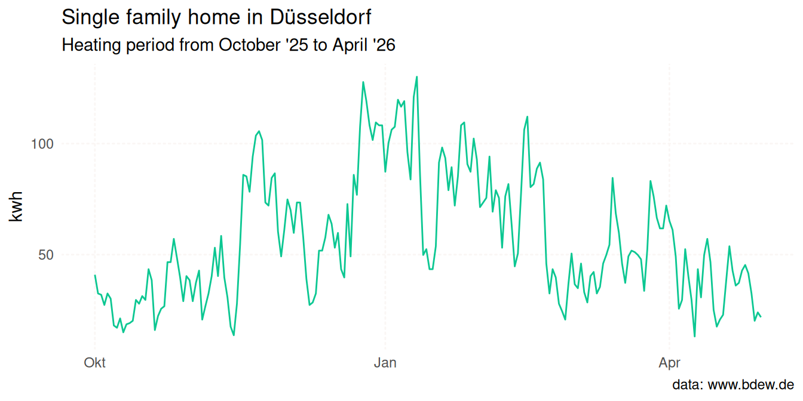
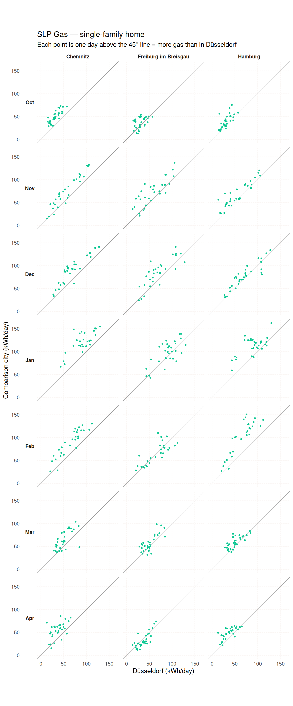

<!-- README.md is generated from README.Rmd. Please edit that file -->

# standardlastprofile

<!-- badges: start -->

[](https://github.com/flrd/standardlastprofile/actions/workflows/R-CMD-check.yaml)
[](https://app.codecov.io/gh/flrd/standardlastprofile)
[](https://cran.r-project.org/package=standardlastprofile)
[](https://cran.r-project.org/package=standardlastprofile)
<!-- badges: end -->

Standard load profiles (SLPs) for electricity and gas, published by the
German Association of Energy and Water Industries (BDEW Bundesverband
der Energie- und Wasserwirtschaft e.V.). SLPs are used by utilities,
distribution network operators, and the energy industry to forecast
demand for customer groups that are not continuously metered.


## Installation

``` r
install.packages("standardlastprofile")
```

## Included features

- `slp_info()` — descriptions for all electricity and gas profile IDs

**Electricity**

- `slp_electricity_profiles` — dataset of BDEW electricity SLPs in tidy
  format
- `slp_electricity()` — generate a 15-minute profile for any date range

**Gas**

- `slp_gas()` — generate daily gas consumption via the SigLinDe method
- `slp_gas_coefficients()` — retrieve SigLinDe coefficients for gas SLPs
- `slp_gas_kundenwert()` — derive the customer value (German:
  “Kundenwert”) from a reference temperature series
- `slp_gas_siglinde()` — low-level SigLinDe function, can be useful for
  custom or region-specific SigLinDe coefficients
- `slp_gas_weekday_factors()` — retrieve weekday factors for gas SLPs

## Electricity

The dataset `slp_electricity_profiles` contains 26,784 observations
across 5 variables:

- `profile_id`: load profile identifier
- `period`: `"summer"`, `"winter"`, or `"transition"` for 1999 profiles;
  a lowercase month name for 2025 profiles
- `day`: `"workday"`, `"saturday"`, or `"sunday"`
- `timestamp`: quarter-hour start time in `"%H:%M"` format
- `watts`: average electric power, normalised to 1,000 kWh/a

``` r
str(slp_electricity_profiles)
#> 'data.frame':    26784 obs. of  5 variables:
#>  $ profile_id: chr  "H0" "H0" "H0" "H0" ...
#>  $ period    : chr  "winter" "winter" "winter" "winter" ...
#>  $ day       : chr  "saturday" "saturday" "saturday" "saturday" ...
#>  $ timestamp : chr  "00:00" "00:15" "00:30" "00:45" ...
#>  $ watts     : num  70.8 68.2 65.9 63.3 59.5 55 50.5 46.6 43.9 42.3 ...
```

### 1999 profiles

Based on an analysis of 1,209 load profiles of low-voltage electricity
consumers in Germany[^1]:

- `H0`: households
- `G0`–`G6`: commercial
- `L0`–`L2`: agriculture

### 2025 profiles

An updated set published by BDEW in 2025, reflecting changes in
consumption patterns since the original study. Unlike the 1999 profiles
(three seasonal periods), the 2025 profiles provide values for each
calendar month:

- `H25`, `G25`, `L25`: updated household, commercial, and agriculture
  profiles
- `P25`: households with a photovoltaic (PV) system
- `S25`: households with a PV system and battery storage


The chart below compares cumulative energy consumption of the 2025
household profiles against `H0` over a full year. `H25` tracks `H0`
closely; `P25` and `S25` flatten from spring through summer as solar
generation and storage reduce grid draw.


### Generate a profile

`slp_electricity()` returns a data frame with one row per 15-minute
interval:

``` r
G5 <- slp_electricity(
  profile_id = "G5",
  start_date = "2023-12-22",
  end_date   = "2023-12-27"
)

head(G5)
#>   profile_id          start_time            end_time watts
#> 1         G5 2023-12-22 00:00:00 2023-12-22 00:15:00  50.1
#> 2         G5 2023-12-22 00:15:00 2023-12-22 00:30:00  47.4
#> 3         G5 2023-12-22 00:30:00 2023-12-22 00:45:00  44.9
#> 4         G5 2023-12-22 00:45:00 2023-12-22 01:00:00  43.3
#> 5         G5 2023-12-22 01:00:00 2023-12-22 01:15:00  43.0
#> 6         G5 2023-12-22 01:15:00 2023-12-22 01:30:00  43.8
```


### Public holidays

Both `slp_electricity()` and `slp_gas()` use the same holiday logic:
nine nationwide German public holidays are treated as Sundays by
default:

- New Year’s
- Good Friday
- Easter Monday
- Labour Day
- Ascension Day
- Whit Monday
- German Unity Day
- Christmas Day
- Boxing Day

State-level holidays are not included because they vary by state and
year. Use the `holidays` argument in either function to supply your own
dates — the built-in data are then ignored entirely. See the
[electricity
article](https://flrd.github.io/standardlastprofile/articles/slp-electricity.html#public-holidays)
for an example of how to fetch state-level holidays from the [nager.Date
API](https://date.nager.at).

## Gas

`slp_gas()` implements the [BDEW/VKU/GEODE synthetic procedure (SigLinDe
method)](https://www.bdew.de/media/documents/251028_LF_SLP_Gas_KoV_XIV.2.pdf)
for daily gas consumption. The gas consumption on any particular day is
influenced by three factors:

1.  outside temperature
2.  personal preferences (`kundenwert`)
3.  the day of the week

`slp_gas()` hence takes a date vector for which the gas consumption
should be calculated, a vector of daily mean temperatures and a
`kundenwert` (customer value in kWh/day), together with one of 15 gas
profile IDs.

Pass `dates` and `temps` to `slp_gas()` together with the `kundenwert`.

> The `kundenwert` of 55.1 kWh/day is itself derived once, from the
> customer’s annual consumption and a reference temperature series. See
> the [gas
> article](https://flrd.github.io/standardlastprofile/articles/slp-gas.html)
> for that step and the full method.

The result of `slp_gas()` is a data frame with three columns:
`profile_id`, `date`, and `kwh` which is the daily gas consumption:

``` r
HEF <- slp_gas("HEF", dates, temps, kundenwert = 55.1)
head(HEF)
#>   profile_id       date      kwh
#> 1        HEF 2025-10-01 40.95047
#> 2        HEF 2025-10-02 32.50304
#> 3        HEF 2025-10-03 31.91795
#> 4        HEF 2025-10-04 27.32729
#> 5        HEF 2025-10-05 32.50304
#> 6        HEF 2025-10-06 30.17767
```



In the example above we assumed a single-family home (profile `HEF`) in
Düsseldorf.

In the following graph, we compare the same customer (i.e. we set the
`kundenwert`) for the same period – October 2025 to April 2026 – with
three other locations. This allows us to isolate the influence of the
outside temperature on gas consumption in these cities:

- Chemnitz,
- Freiburg im Breisgau, and
- Hamburg.

Each point represents a single day in the period from 1 October 2025 to
30 April 2026. Points above the 45° line indicate that the customer
would have consumed more gas than in Düsseldorf. We can see that this
winter was colder in all three cities than in Düsseldorf, so all the
points lie above the line – most notably in Chemnitz, least so in
Freiburg im Breisgau, with Hamburg in between:



For a detailed explanation of the SigLinDe parameters and the full
climate zone comparison, see the [gas
articles](https://flrd.github.io/standardlastprofile/articles/index.html)
on the package website.

## Sources

- Electricity SLPs:
  <https://www.bdew.de/energie/standardlastprofile-strom/>
- Gas SLPs: <https://www.bdew.de/energie/standardlastprofile-gas/>

## Code of Conduct

Please note that this project is released with a [Contributor Code of
Conduct](https://github.com/flrd/standardlastprofile/blob/main/CODE_OF_CONDUCT.md).
By participating in this project you agree to abide by its terms.

[^1]: Methodology:
    <https://www.bdew.de/media/documents/1999_Repraesentative-VDEW-Lastprofile.pdf>
